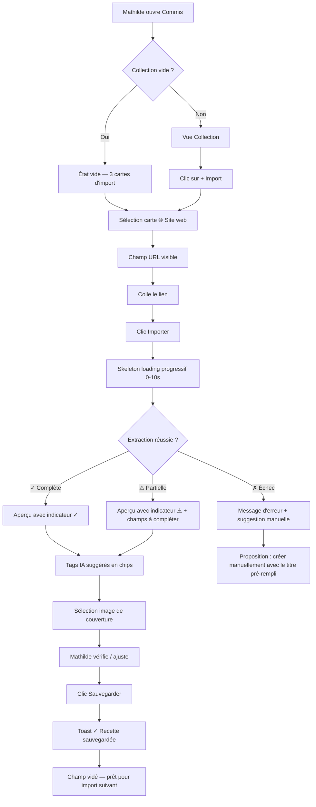
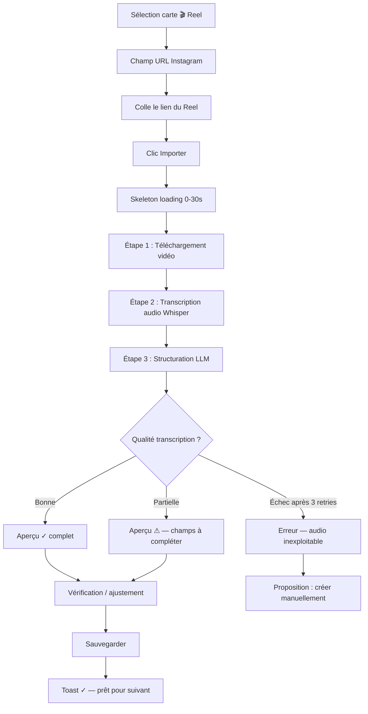
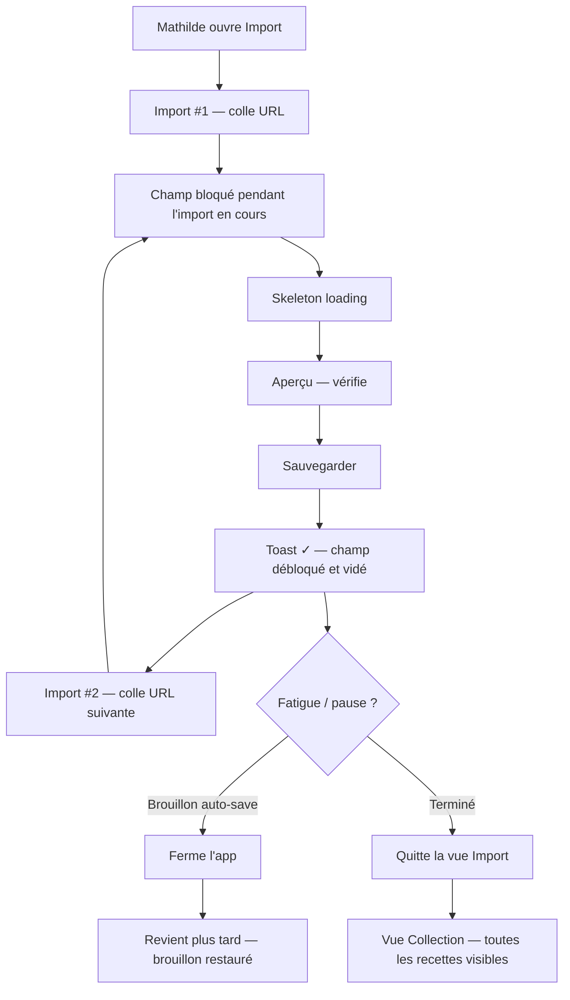
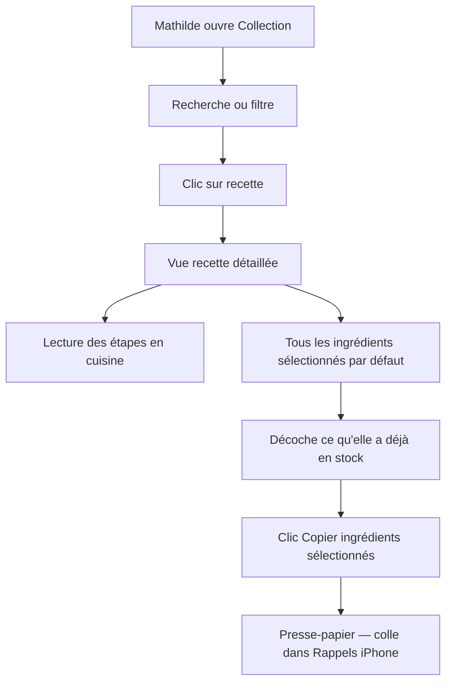
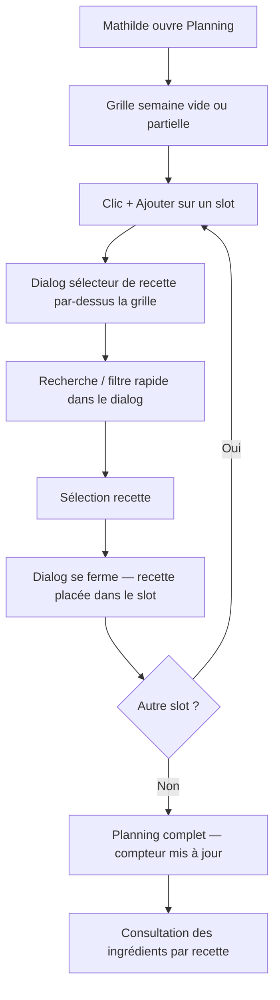
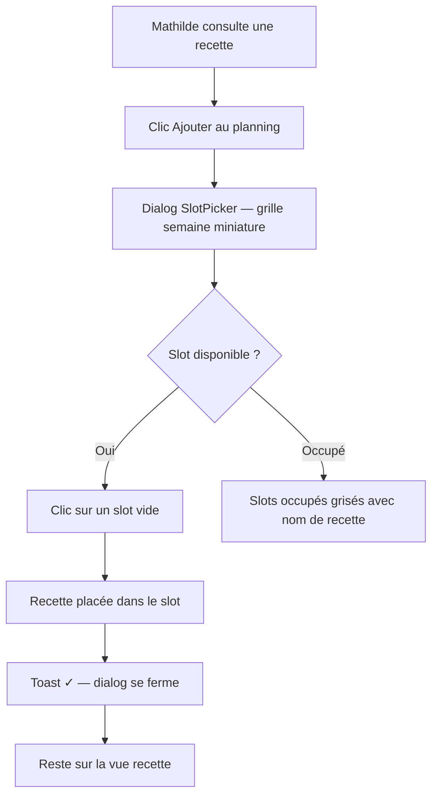

# UX Design Specification — Commis

**Author:** Gauthier
**Date:** 2026-02-11

---

## Executive Summary

### Project Vision

Commis est une app web francophone de gestion de recettes personnelles, conçue pour centraliser des recettes multi-sources (sites web, Reels Instagram, saisie manuelle) dans un espace unique, organisé et cherchable. L'app inclut un meal planner hebdomadaire et un système de copie d'ingrédients pour simplifier les courses.

### Target Users

**Mathilde (utilisatrice principale) :**
- Pas particulièrement à l'aise avec la tech — l'interface doit fonctionner sans connaissance technique
- Usage desktop le dimanche (sessions longues : import, organisation, planification) — contexte principal d'édition
- Usage mobile le soir sur le canapé (consultation de recettes, feedback après cuisine) — contexte principal de lecture
- La planification peut occasionnellement se faire sur mobile
- Frustrations principales : perte de données et imports qui échouent

**Gauthier (utilisateur indirect) :**
- Reçoit la liste de courses via Rappels iPhone
- N'interagit pas directement avec Commis

### Key Design Challenges

1. **Accessibilité cognitive** : Interface immédiatement compréhensible pour une utilisatrice non-technique. Zéro jargon, actions évidentes, pas de courbe d'apprentissage
2. **Deux modes d'usage** : Desktop = édition/import/planification, Mobile = consultation/feedback. Le design doit être optimisé pour chaque contexte, pas simplement adapté
3. **Confiance dans les imports** : Feedback visuel clair, gestion gracieuse des erreurs, guides contextuels pour les actions non-évidentes (ex: comment copier un lien Instagram)
4. **Protection contre la perte de données** : Auto-save ou avertissement "modifications non sauvegardées" pour éviter la frustration principale de Mathilde
5. **Meal planner responsive** : Édition complète sur desktop (grille semaine), vue consultation simplifiée sur mobile (ce qu'on mange ce soir)

### Design Opportunities

1. **Moment "wow" de l'onboarding** : Vue collection visuellement satisfaisante quand Mathilde voit toutes ses recettes organisées pour la première fois
2. **Flow import magique** : Coller un lien → résultat structuré en quelques secondes. Simplicité qui crée le réflexe de capture
3. **Copier ingrédients sans friction** : Sélection → copier en un geste, élimine la friction courses et devient indispensable
4. **Aide contextuelle discrète** : Guides intégrés au premier usage (comment copier un lien, comment organiser ses tags) qui disparaissent ensuite

## Core User Experience

### Defining Experience

**Action fondatrice :** L'import de recette. Coller un lien → voir la recette apparaître structurée. C'est le geste qui crée la valeur et le réflexe de capture.

**Action quotidienne :** La consultation. Mathilde ouvre Commis le soir pour voir ce qu'elle cuisine.

**Boucle hebdomadaire :** Import → Organisation → Planification → Courses.

### Platform Strategy

- **Desktop (dimanche)** : Sessions longues — import en série, organisation des tags, planification de la semaine. Interface optimisée pour l'édition.
- **Mobile (soir)** : Sessions courtes — consultation de la recette du jour, feedback après cuisine. Interface optimisée pour la lecture.
- **Web SPA** : Safari iOS (prioritaire) + Chrome desktop. Pas de PWA, pas d'offline.

### Import Strategy

**Sélecteurs d'import distincts (style Midjourney) :** Trois cartes visuelles avec identité propre :
1. **🌐 Import site web** : Coller une URL → Pipeline à 3 niveaux :
   - JSON-LD Schema.org/Recipe → extraction directe + tags depuis métadonnées schema (cuisine, category, keywords)
   - HTML parsing structurel → extraction par heuristiques
   - LLM fallback (blogs narratifs) → extraction IA du texte brut + suggestion de tags mutualisée
2. **🎬 Import Reel/vidéo** : Coller un lien → Pipeline IA (Whisper + LLM structuration + suggestion de tags mutualisée)
3. **✏️ Créer manuellement** : Formulaire de saisie directe. Tags suggérés après sauvegarde (asynchrone).

Chaque carte s'agrandit au clic pour révéler le champ de saisie.

**Post-import commun :**
- Aperçu avant sauvegarde
- Indicateur de confiance explicite :
  - ✓ "Recette complète" → sauvegarde directe possible
  - ⚠ "À vérifier — certains champs peuvent être incomplets" → relecture recommandée
  - Échec total → message d'erreur (pas d'indicateur)
- Catégorisation IA suggérée (tags proposés, modifiables par l'utilisateur)
- Correction manuelle possible sur tous les champs
- Brouillon auto-save en localStorage pendant l'édition d'import, sauvegarde définitive uniquement à la confirmation

### Effortless Interactions

- **Import** : Choisir la carte, coller un lien, voir le résultat. Zéro configuration, zéro jargon.
- **Catégorisation** : Suggestions automatiques par IA, un tap pour accepter/modifier.
- **Copier ingrédients** : Sélection → désélection du stock → copier. Trois gestes max.
- **Auto-save** : Brouillon localStorage pendant l'édition. Proposition de reprise au rechargement ("Vous avez un brouillon non sauvegardé. Reprendre ?"). Jamais de perte de données.

### Critical Success Moments

1. **Premier import réussi** : Mathilde colle un lien, la recette apparaît structurée avec des tags suggérés. "C'est magique."
2. **Vue collection** : Elle voit toutes ses recettes organisées au même endroit. "C'est exactement ce qu'il me fallait."
3. **Planification en 20 min** : Elle place ses recettes dans le meal planner et copie les ingrédients. "C'est tellement plus rapide."

### Experience Principles

1. **Zéro friction** : Chaque action en minimum de gestes. Pas de configuration, pas de jargon.
2. **Confiance** : L'utilisateur sait toujours ce qui se passe (état d'import, indicateur de confiance, auto-save, erreurs claires).
3. **Contrôle** : L'IA suggère, l'utilisateur décide. Tags, corrections, organisation — toujours la main.
4. **Contexte adapté** : Desktop pour agir, mobile pour consulter. L'interface s'adapte au mode d'usage.

## Desired Emotional Response

### Primary Emotional Goals

- **Efficacité** : Mathilde se sent productive et organisée. "Ça me fait gagner un temps fou."
- **Inspiration** : Parcourir sa collection donne envie de cuisiner, de découvrir, d'essayer de nouvelles recettes.

### Emotional Journey Mapping

| Moment | Émotion visée | Déclencheur |
|--------|--------------|-------------|
| Onboarding (première ouverture) | Curiosité, confiance | Les trois cartes d'import visibles, message d'accueil simple, compréhension immédiate |
| Premier import | Émerveillement | "J'ai collé un lien et la recette est apparue toute seule" |
| Vue collection | Fierté, satisfaction | Voir toutes ses recettes organisées au même endroit |
| Planification terminée | Soulagement, efficacité | Semaine planifiée en 20 min au lieu de 2-3h |
| Consultation le soir | Calme, simplicité | Ouvrir la recette du jour, tout est là, lisible |
| Feedback après cuisine | Accomplissement | Noter ses ajustements, améliorer pour la prochaine fois |
| Import partiel | Rassurée, guidée | "Presque ! Quelques champs à compléter" + champs manquants mis en évidence |
| Échec total d'import | Pas de panique, honnêteté | "Impossible d'accéder à cette page. Vérifiez le lien ou essayez un autre." |
| Retour dans l'app | Familiarité | Tout est comme elle l'a laissé, rien n'a disparu |

### Micro-Emotions

- **Confiance > Confusion** : Mathilde sait toujours où elle en est. Pas de doute, pas de "j'ai perdu quelque chose ?"
- **Accomplissement > Frustration** : Même un import partiel est un gain de temps. Le verre est toujours à moitié plein.
- **Calme > Anxiété** : Auto-save, indicateurs clairs, messages explicites. Zéro stress.

### Design Implications

| Émotion | Implication UX |
|---------|---------------|
| Curiosité (onboarding) | Trois cartes d'import visibles dès l'arrivée, message d'accueil simple, zéro tutoriel |
| Émerveillement (import) | Animation subtile de chargement → apparition fluide de la recette structurée |
| Fierté (collection) | Vue collection visuellement riche, compteur de recettes |
| Soulagement (planification) | Feedback visuel quand le planning de la semaine est complet |
| Rassurance (import partiel) | Ton positif, champs manquants mis en évidence, suggestions de correction |
| Honnêteté (échec total) | Message clair et factuel, pas de fausse positivité, options alternatives proposées |
| Calme (consultation) | Interface épurée en mode lecture, focus sur le contenu, pas de distractions |

### Emotional Design Principles

1. **Honnête et encourageant** : Positif quand c'est justifié, factuel quand ça ne marche pas. Jamais de fausse positivité.
2. **Progression visible** : Compteur de recettes, planning qui se remplit. Sentiment d'accomplissement simple et concret.
3. **Zéro stress** : Auto-save, indicateurs clairs, messages explicites. L'app ne crée jamais d'anxiété.
4. **Simplicité apaisante** : Interface épurée en consultation, pas de surcharge visuelle. Le contenu prime.

## UX Pattern Analysis & Inspiration

### Inspiring Products Analysis

**Midjourney — Le flow de génération :**
- Sélecteurs de mode distincts avec identité visuelle propre
- Input simple (coller/taper) → résultat généré qui s'agence automatiquement
- Feedback visuel pendant la génération (progression)
- **Applicable à Commis :** Les trois cartes d'import, le flow coller → générer → voir le résultat structuré

**Pinterest — La collection visuelle :**
- Grid masonry pour parcourir du contenu visuel
- Scroll infini fluide
- Boards/collections pour organiser par thème
- **Applicable à Commis :** Vue collection de recettes, organisation par tags/catégories, scroll infini

**Instagram — La navigation simple :**
- Tab bar en bas (mobile), claire et immédiate
- Actions rapides accessibles en un tap
- **Applicable à Commis :** Navigation mobile simplifiée, actions rapides sur les recettes

### Transferable UX Patterns

**Navigation :**
- Tab bar 4 onglets sur mobile : 🏠 Collection, ➕ Import, 📅 Planning, 👤 Profil
- Sidebar sur desktop avec les mêmes sections

**Collection :**
- Grid visuel avec images de couverture des recettes
- Import URL web : images scrapées depuis l'article, sélection de couverture pendant l'aperçu (première image par défaut)
- Import Reel : thumbnail extraite via oEmbed Instagram
- Création manuelle : fallback carte titre + tags (upload photo post-MVP)
- Tags/catégories comme filtres latéraux (desktop) ou chips scrollables (mobile)
- Scroll infini avec virtualisation (performance 500+ recettes)
- Compteur de recettes discret en haut de la collection

**Import :**
- Cartes sélecteurs style Midjourney — chaque mode d'import a sa carte
- Desktop : la carte s'agrandit au clic → champ de saisie → bouton "Importer"
- Mobile : la carte se transforme en champ de saisie inline (pas de modale)
- Résultat qui apparaît progressivement (animation de structuration)

**États vides :**
- Collection vide → message engageant + cartes d'import directement accessibles ("Importez votre première recette !")
- Planning vide → invitation à parcourir la collection pour remplir la semaine
- Jamais d'écran vide sans guidance

**Interaction :**
- Actions contextuelles rapides sur les cartes recettes
- Copier ingrédients en un tap depuis la vue recette

### Anti-Patterns to Avoid

1. **Surcharge d'options** : Max 4 destinations dans la navigation. Pas de menu hamburger.
2. **Onboarding forcé** : Pas de tutoriel multi-écrans. L'interface est auto-explicative.
3. **Modales intempestives** : Zéro pop-up d'interruption.
4. **Formulaires longs** : Import = un champ + un bouton. Création manuelle progressive.
5. **États vides non guidés** : Jamais d'écran vide sans call-to-action clair.

### Design Inspiration Strategy

**Adopter :**
- Grid visuel avec images pour la collection (+ sélection d'image de couverture à l'import)
- Tab bar 4 onglets pour la navigation mobile
- Cartes sélecteurs Midjourney pour l'import
- États vides engageants

**Adapter :**
- Grid Pinterest → uniforme si pas d'images, avec fallback titre + tags
- Flow Midjourney → agrandissement desktop, inline mobile
- Scroll infini → avec virtualisation et compteur

**Éviter :**
- La complexité de Flavorish (trop de features visibles)
- Les interruptions d'Instagram (notifications, suggestions)
- Le scroll sans repères de Pinterest

## Design System Foundation

### Design System Choice

**shadcn/ui** — Système de composants basé sur Tailwind CSS v4 + Radix UI primitives.

### Rationale for Selection

1. **Gratuit et open source** : Aucun coût, communauté active
2. **100% personnalisable** : Composants copiés dans le projet, modification libre
3. **Tailwind natif** : S'intègre avec la stack (Next.js + Tailwind CSS v4). Design tokens gérés via CSS custom properties (Tailwind v4)
4. **Accessible par défaut** : Radix UI primitives (gestion clavier, ARIA, focus)
5. **Standard Next.js** : Écosystème le plus populaire, documentation abondante
6. **Composants à la carte** : On n'installe que ce dont on a besoin

### Implementation Approach

- Installer shadcn/ui CLI dans le projet Next.js
- Composants dans `src/components/ui/` — modifiables à tout moment
- Design tokens (couleurs, spacing, typographie, radius) définis en CSS custom properties
- **Composants shadcn/ui** : Button, Card, Input, Dialog, Tabs, Select, Dropdown, etc. — briques standards
- **Composants custom métier** : Cartes d'import (style Midjourney), meal planner (grille semaine), vue recette, vue collection — construits avec les primitives shadcn/ui + Tailwind

### Customization Strategy

- **Dès le Bloc 1** : Personnalisation minimale des CSS variables — border-radius (plus arrondis, feeling chaleureux), typographie (friendly, pas dashboard), couleur primaire. ~30 min de travail.
- **Bloc 2-3** : Affiner l'identité visuelle au fur et à mesure que les vues métier prennent forme
- **Post-MVP** : Charte graphique complète si ouverture au public

## Defining Core Experience

### Defining Experience

> "Tu colles un lien, et la recette apparaît toute structurée."

Interaction signature de Commis. Le vrai game changer n'est pas l'import lui-même — c'est la **retrouvabilité**. Passer de "j'ai vu cette recette quelque part dans mes favoris" à "je la trouve en 3 secondes dans Commis, avec les ingrédients bien listés".

### User Mental Model

**Comportement actuel de Mathilde :**
- Voit une recette qui lui plaît → met en favoris Instagram ou dans un dossier de la barre de favoris du navigateur
- Résultat : des dizaines de favoris éparpillés, impossibles à retrouver, sans structure

**Modèle mental attendu avec Commis :**
- Voit une recette → copie le lien → colle dans Commis → c'est sauvegardé, structuré, retrouvable
- Le geste de "sauvegarder" passe de passif (favori) à actif (import structuré)
- La valeur perçue : "tout est au même endroit, je retrouve tout"

**Friction à éliminer :**
- Le passage de "je vois une recette" à "elle est dans Commis" doit être aussi rapide que mettre en favori
- L'aperçu est obligatoire à chaque import (sécurité des données) mais doit être rapide à valider

### Success Criteria

| Critère | Indicateur |
|---------|----------|
| "Ça marche" | La recette apparaît structurée avec titre, ingrédients, étapes lisibles |
| "C'est rapide" | Import web < 10s, Reel < 30s, avec skeleton loading progressif |
| "Je retrouve tout" | Recherche par texte, filtre par tag, scroll dans la collection → résultat en < 2s |
| "C'est mieux qu'avant" | Mathilde ne retourne plus dans ses favoris Instagram pour chercher une recette |

### Novel UX Patterns

**Patterns établis (pas besoin d'éduquer) :**
- Copier-coller un lien → geste universel
- Grid de cartes visuelles → pattern Pinterest/Instagram
- Tab bar en bas → pattern iOS natif
- Recherche texte libre → pattern universel

**Patterns adaptés (familiers avec twist) :**
- Cartes sélecteurs d'import (style Midjourney) → auto-explicatif grâce aux icônes et labels
- Indicateur de confiance post-import → intuitif (✓ complet / ⚠ à vérifier)
- Meal planner grille semaine → pattern calendrier adapté aux recettes

**Aucun pattern vraiment novel** → pas besoin de tutoriel. Interface auto-explicative.

### Experience Mechanics

**1. Initiation :**
- Mathilde ouvre Commis → voit les cartes d'import (ou état vide engageant si première visite)
- Elle choisit la carte correspondant à sa source (🌐 site web, 🎬 Reel, ✏️ manuel)

**2. Interaction :**
- La carte s'ouvre → champ de saisie visible
- Elle colle le lien → appuie sur "Importer"
- Skeleton loading progressif : titre (0-2s) → ingrédients (2-5s) → étapes (5-10s) → contenu réel remplace les skeletons

**3. Feedback :**
- Résultat apparaît progressivement dans l'aperçu
- Indicateur de confiance : ✓ "Recette complète" ou ⚠ "À vérifier"
- Tags suggérés par IA en chips modifiables
- Sélection d'image de couverture parmi les images scrapées

**4. Completion :**
- Aperçu obligatoire à chaque import — Mathilde vérifie, ajuste si besoin
- Bouton "Sauvegarder" → toast de confirmation "Recette sauvegardée ✓"
- **Import en série** : reste sur la vue import, champ vidé et prêt pour le prochain lien
- Retour à la collection uniquement quand elle quitte la vue import

## Visual Design Foundation

### Color System

**Direction inspirée de Claude (Anthropic) — tons chauds et terreux :**

- **Background principal** : Beige/sable chaud (pas blanc froid)
- **Background secondaire** : Blanc cassé pour les cartes et surfaces élevées
- **Texte principal** : Brun très foncé (pas noir pur — plus doux pour les yeux)
- **Accent primaire** : Orange/terracotta — chaleureux, appétissant, évoque la cuisine. Vérifier le contraste sur fond beige pour les boutons.
- **Accent secondaire** : À définir selon les besoins
- **Sémantique** : Succès (vert doux), Avertissement (ambre), Erreur (rouge doux, pas agressif)

**Rationale** : Les tons chauds créent une ambiance "cuisine maison". Le beige en fond est plus reposant que le blanc pour les sessions longues du dimanche.

### Typography System

**Combo : Lora (titres) + Poppins (corps)**

- **Lora** : Serif éditorial équilibré, bon rendu sur écran, donne un côté "beau livre de cuisine" aux noms de recettes
- **Poppins** : Sans-serif géométrique, friendly et arrondi, très lisible sur mobile pour les listes d'ingrédients et les étapes
- **Chargement** : Auto-hébergées via `next/font` (performance, pas de FOUT, conforme RGPD)

**Type Scale :**
- H1 : Titre de page ("Ma Collection") — Lora, grand
- H2 : Nom de recette — Lora, moyen
- H3 : Sections (Ingrédients, Étapes) — Poppins, semi-bold
- Body : Texte courant, ingrédients, étapes — Poppins, regular
- Small : Tags, métadonnées, timestamps — Poppins, light

### Spacing & Layout Foundation

**Approche aérée — respiration et calme :**

- **Base unit** : 8px (standard shadcn/ui)
- **Densité** : Aérée — beaucoup d'espace entre les éléments, surtout en mode consultation mobile
- **Coins** : Arrondis généreux (border-radius: 12-16px) — feeling chaleureux
- **Ombres** : Subtiles et douces — élévation légère des cartes
- **Transitions** : Douces et fluides (200-300ms)

**Layout :**
- Desktop : Max-width ~1200px, sidebar navigation, contenu centré
- Mobile : Full-width, tab bar en bas, contenu plein écran
- Grid collection : 3-4 colonnes desktop, 2 colonnes mobile

### Icons

- **Lucide Icons** : Bibliothèque par défaut de shadcn/ui, 1000+ icônes, style cohérent
- **Cartes d'import** : Icônes Lucide en grande taille (32-48px) avec fond arrondi subtil pour plus de présence visuelle
- Pas d'icônes custom nécessaires

### Accessibility Considerations

- Contraste texte/fond ≥ 4.5:1 (WCAG AA) — brun foncé sur beige ~12:1 ✓
- Vérifier contraste accent terracotta sur fond beige pour les boutons
- Taille de texte minimum 16px sur mobile pour ingrédients/étapes
- Focus visible sur tous les éléments interactifs (Radix)
- Pas de couleur seule comme indicateur — toujours icône + texte (✓ / ⚠)

## Design Direction Decision

### Design Directions Explored

Mockups interactifs générés dans `ux-design-directions.html` couvrant 7 vues :
1. **Collection** — Grid visuel avec cartes, recherche, filtres par tags, compteur
2. **Import** — 3 cartes sélecteurs style Midjourney avec champ de saisie contextuel
3. **Recette** — Vue détaillée éditoriale avec ingrédients cochables, copier, notes
4. **Planning** — Grille semaine 7 colonnes avec slots midi/soir
5. **État vide** — Onboarding première visite avec 3 cartes d'import
6. **Loading** — Skeleton loading progressif animé avec barre de progression
7. **Mobile** — 2 maquettes iPhone (collection liste + consultation recette)

### Chosen Direction

Direction unique validée — pas de variantes concurrentes. Le style "Claude/Anthropic adapté cuisine" fonctionne sur toutes les vues.

### Design Rationale

- **Tons chauds terreux** : Créent une ambiance cuisine maison, cohérente avec l'usage
- **Lora + Poppins** : Combo éditorial + lisible, feeling "beau livre de cuisine"
- **Coins arrondis généreux** : Chaleureux, accessible, pas anguleux
- **Ombres subtiles** : Élévation douce, pas d'agressivité visuelle
- **Spacing aéré** : Calme, respiration, adapté aux sessions longues

### Design Tokens (référence)

| Token | Valeur |
|-------|--------|
| bg-primary | #F5EDE3 (beige/sable) |
| bg-secondary | #FDFAF6 (blanc cassé) |
| bg-card | #FFFFFF |
| text-primary | #2C1810 (brun foncé) |
| text-secondary | #6B5344 |
| text-muted | #9C8578 |
| accent-primary | #C4704B (terracotta) |
| accent-secondary | #7B9E6B (vert sauge) |
| border | #E8DDD2 |
| success | #6B9E5B |
| warning | #D4A03C |
| error | #C45B5B |
| radius-sm/md/lg/xl | 8/12/16/20px |
| font-serif | Lora |
| font-sans | Poppins |

### Implementation Approach

- Transposer les CSS variables du HTML vers les CSS custom properties de shadcn/ui (Tailwind v4)
- Les mockups HTML servent de référence visuelle pendant le développement
- Chaque vue sera implémentée en composants React avec les mêmes tokens

## User Journey Flows

### Journey 1 : Import Web (flow principal)

Le flow le plus fréquent — Mathilde colle un lien et obtient une recette structurée.

### Journey 2 : Import Reel Instagram

Flow similaire mais avec transcription audio — plus long, plus de risque d'extraction partielle.

### Journey 3 : Import en série (Onboarding)

Le dimanche de Mathilde — 40 recettes à importer. Le flow reste fluide sans navigation entre chaque import.

**Note MVP** : Le champ est bloqué pendant un import en cours (un seul import à la fois). Post-MVP : file d'attente d'imports parallèles.

### Journey 4 : Consultation + Courses

Le soir en cuisine ou au supermarché — Mathilde consulte et copie les ingrédients.

**Comportement par défaut** : Tous les ingrédients sont cochés. Mathilde décoche ce qu'elle a déjà — plus rapide quand on a besoin de presque tout.

### Journey 5 : Meal Planning

Planification de la semaine — placement des recettes dans la grille.

**Sélecteur recette** : Dialog/modal avec recherche intégrée — Mathilde voit toujours la grille derrière et garde le contexte du slot qu'elle remplit.

### Journey 5b : Ajouter au planning depuis la recette

Flow alternatif — Mathilde consulte une recette et veut la placer dans le planning sans naviguer.

**Deux chemins pour remplir le planning :**
- **Depuis le planning** → RecipePickerDialog (je choisis quel slot, puis quelle recette)
- **Depuis la recette** → SlotPickerDialog (j'ai la recette, je choisis quel slot)

### Journey Patterns

**Patterns communs :**
- **Import → Aperçu → Sauvegarde** : Toujours le même triptyque, quelle que soit la source
- **Feedback progressif** : Skeleton loading → contenu réel, jamais d'écran blanc
- **Rester en place** : Après une action (import, placement planning), on reste dans le contexte
- **Bidirectionnalité** : Le planning est accessible depuis la grille (choisir recette) ET depuis la recette (choisir slot)
- **Récupération gracieuse** : Extraction partielle → champs pré-remplis + édition, jamais de perte totale
- **Toast non-bloquant** : Confirmation sans interrompre le flow

**Patterns de navigation :**
- **Desktop** : Sidebar permanente (Collection, Import, Planning, Profil)
- **Mobile** : Tab bar 4 onglets (Collection, Import, Planning, Profil)
- **Retour contextuel** : Depuis une recette ouverte via le Planning → retour au Planning. Depuis la Collection → retour à la Collection au même scroll. Le contexte de provenance est toujours préservé.

### Flow Optimization Principles

1. **Minimum de clics vers la valeur** : Coller un lien → 2 clics (Importer + Sauvegarder) pour une recette complète
2. **Pas de navigation entre imports** : Le flow en série ne quitte jamais la vue Import
3. **Auto-save permanent** : Brouillon sauvegardé en localStorage, jamais de perte de données
4. **Feedback à chaque étape** : L'utilisateur sait toujours où il en est (skeleton, indicateur, toast)
5. **Erreur = point de départ** : Un échec d'import propose toujours une alternative (édition manuelle avec données pré-remplies)
6. **Un import à la fois (MVP)** : Champ bloqué pendant l'import en cours, file d'attente post-MVP

## Component Strategy

### Design System Components (shadcn/ui)

| Composant shadcn/ui | Usage dans Commis |
|---------------------|-------------------|
| Button | Actions principales (Importer, Sauvegarder), secondaires (Copier, Annuler) |
| Card | Cartes recettes dans la collection, cartes d'import |
| Input | Champ URL, recherche, champs formulaire |
| Dialog | Sélecteur recette/slot dans le meal planner, confirmations |
| Tabs | Navigation Ingrédients / Étapes / Notes dans la vue recette |
| Select | Sélection de catégories, filtres |
| Badge | Tags de recettes (chips modifiables) |
| Toast | Notifications non-bloquantes |
| Skeleton | Loading progressif pendant l'import |
| Checkbox | Sélection/désélection d'ingrédients |
| Dropdown Menu | Actions contextuelles (éditer, supprimer, déplacer) |
| Form | Formulaires d'édition et création (via react-hook-form) |
| Tooltip | Aide contextuelle |
| Scroll Area | Listes longues, collection avec scroll infini |
| Separator | Séparation visuelle entre sections |

### Custom Components

#### 1. ImportSourceSelector

- **Purpose** : Choisir la source d'import (site web, Reel, manuel)
- **Anatomy** : 3 cartes côte à côte (style Midjourney), icône Lucide (32-48px) + fond arrondi, titre, description
- **States** : Default, Hover (border accent), Selected (border accent + fond teinté), Disabled (pendant import en cours)
- **Variants** : Desktop (3 colonnes), Mobile (3 colonnes compactes ou empilées)
- **Interaction** : Clic → sélection → champ de saisie correspondant apparaît en dessous

#### 2. RecipeCard

- **Purpose** : Afficher une recette dans différents contextes
- **Anatomy** : Image de couverture (ou fallback emoji), titre (Lora), tags (Badge), source
- **States** : Default, Hover (élévation + translateY), Loading (skeleton)
- **Variants** :
  - **Grid** : Desktop collection — image en haut, infos en dessous
  - **List** : Mobile collection — image à gauche, infos à droite
  - **Compact** : Dialogs (RecipePickerDialog) — titre + tag principal, pas d'image
- **Interaction** : Clic → navigation vers vue recette détaillée

#### 3. RecipePreview

- **Purpose** : Aperçu post-import avant sauvegarde — composant le plus critique du flow
- **Anatomy** : Indicateur de confiance, titre éditable, image sélectionnable, ingrédients éditables, étapes éditables, tags IA en chips
- **States** : Loading (skeleton progressif), Complete (✓), Partial (⚠ avec champs surlignes), Error
- **Implémentation progressive** :
  - **Bloc 2** : Version basique — affichage + édition texte des champs
  - **Bloc 4** : Version enrichie — indicateur confiance, sélection image, tags IA
- **Interaction** : Tous les champs éditables inline. Boutons Sauvegarder / Annuler en bas.

#### 4. IngredientList

- **Purpose** : Liste d'ingrédients avec sélection pour copier
- **Anatomy** : Checkbox par ingrédient, texte, compteur sélectionnés, bouton Copier
- **States** : Tous cochés (défaut), partiellement décochés, copié (feedback visuel)
- **Variants** : Mode consultation (checkboxes), mode édition (champs texte + ajout/suppression)
- **Interaction** : Toggle checkbox → mise à jour compteur. Copier → presse-papier + toast.

#### 5. MealPlannerGrid

- **Purpose** : Grille semaine pour planifier les repas
- **Anatomy** : 7 colonnes (Lun-Dim), slots par jour, cartes recettes, slots vides avec "+"
- **States** : Vide, Partiellement rempli, Complet (avec compteur). Slot vide = pas de repas prévu.
- **Variants** : Desktop (7 colonnes), Mobile (scroll horizontal ou vue liste par jour)
- **Interaction** : Clic "+" → RecipePickerDialog. Clic recette → vue détaillée. Suppression via dropdown.

#### 6. RecipePickerDialog

- **Purpose** : Sélectionner une recette depuis la collection (utilisé dans le meal planner)
- **Anatomy** : Dialog modal, barre de recherche, filtres rapides, liste de RecipeCard (variant Compact)
- **States** : Ouvert, Recherche en cours, Résultats, Aucun résultat
- **Interaction** : Recherche/filtre → sélection → dialog se ferme → recette placée

#### 7. SlotPickerDialog

- **Purpose** : Depuis une recette, choisir dans quel slot du planning la placer
- **Anatomy** : Dialog modal, grille semaine miniature, slots disponibles cliquables, slots occupés grisés
- **States** : Ouvert, Slot sélectionné, Confirmation
- **Variants** : Desktop (grille 7 colonnes miniature), Mobile (vue liste : "Lundi soir — vide")
- **Interaction** : Clic "Ajouter au planning" → dialog → clic slot vide → toast ✓ → fermeture

#### 8. ConfidenceIndicator

- **Purpose** : Indiquer la qualité de l'extraction post-import
- **Anatomy** : Icône + texte (✓ "Recette complète" ou ⚠ "À vérifier")
- **States** : Complete (vert), Partial (ambre), Error (rouge)
- **Variants** : Inline (dans l'aperçu), Badge (dans la carte recette)

#### 9. EmptyState

- **Purpose** : Accueillir Mathilde lors de sa première visite
- **Anatomy** : Icône grande, titre (Lora), description, 3 cartes d'import miniatures
- **Interaction** : Clic sur une carte → navigation vers Import avec source pré-sélectionnée

### Component Implementation Roadmap

**Bloc 1 (Setup + Auth + CRUD) :**
- Button, Input, Card, Toast, Skeleton (shadcn/ui)
- RecipeCard — variants Grid + List (custom)
- EmptyState (custom)

**Bloc 2 (Formulaire + Tags + Organisation) :**
- Badge, Checkbox, Select, Tabs, Scroll Area, Form (shadcn/ui)
- ImportSourceSelector (custom)
- RecipePreview — version basique (custom)
- IngredientList (custom)

**Bloc 3 (Meal Planner) :**
- Dialog, Dropdown Menu (shadcn/ui)
- MealPlannerGrid (custom)
- RecipePickerDialog + RecipeCard variant Compact (custom)
- SlotPickerDialog (custom)

**Bloc 4-5 (Import Web + Instagram) :**
- RecipePreview — version enrichie : ConfidenceIndicator, sélection image, tags IA (custom)
- Pas de nouveaux composants — réutilisation des existants

## UX Consistency Patterns

### Button Hierarchy

| Niveau | Style | Usage |
|--------|-------|-------|
| Primary | Fond accent terracotta, texte blanc, bold | Actions principales : Importer, Sauvegarder, Confirmer |
| Secondary | Bordure accent, fond transparent, texte accent | Actions secondaires : Copier ingrédients, Ajouter au planning |
| Ghost | Pas de bordure, texte muted | Actions tertiaires : Annuler, Retour |
| Destructive | Fond rouge doux, texte blanc | Supprimer une recette, vider un slot |

**Règles :**
- Maximum 1 bouton Primary visible par écran
- Destructive toujours derrière une confirmation (Dialog)
- Sur mobile : boutons Primary pleine largeur en bas de l'écran

### Feedback Patterns

| Situation | Pattern | Durée |
|-----------|---------|-------|
| Succès (sauvegarde, copie) | Toast vert non-bloquant, coin bas-droit | 3s auto-dismiss |
| Erreur récupérable (import partiel) | Indicateur ⚠ inline + champs surlignes | Persistant |
| Erreur bloquante (import échoué) | Message inline avec suggestion alternative | Persistant |
| Chargement court (< 2s) | Spinner dans le bouton | Durée du chargement |
| Chargement long (2-30s) | Skeleton loading progressif + barre de progression | Durée du chargement |
| Validation formulaire | Message sous le champ en rouge doux | Persistant jusqu'à correction |

**Règles :**
- Jamais de modal d'erreur bloquant — toujours inline ou toast
- Toujours proposer une action de récupération après une erreur
- Les toasts ne bloquent jamais le flow en cours

### Form Patterns

**Validation :**
- Validation au blur (quand on quitte le champ), pas en temps réel
- Messages d'erreur sous le champ, en rouge doux, avec texte explicite
- Champs requis marqués visuellement (pas d'astérisque — bordure rouge si vide au submit)

**Édition inline :**
- Dans RecipePreview et vue recette : clic sur le texte → champ éditable
- Sauvegarde au blur ou Entrée, annulation avec Escape
- Feedback visuel discret au survol pour indiquer l'éditabilité

**Auto-save :**
- Brouillons sauvegardés en localStorage toutes les 5 secondes
- Indicateur discret "Brouillon sauvegardé" en texte muted
- Restauration automatique à la réouverture

### Navigation Patterns

**Desktop :**
- Sidebar permanente à gauche : Collection, Import, Planning, Profil
- Item actif surlignaé avec accent primaire
- Contenu principal centré, max-width 1200px

**Mobile :**
- Tab bar fixe en bas : 4 onglets avec icône Lucide + label
- Onglet actif : icône + texte en accent primaire
- Pas de hamburger menu — tout est dans la tab bar

**Retour contextuel :**
- Bouton retour en haut à gauche dans les vues détaillées
- Retour vers le contexte de provenance (Collection ou Planning)
- Préservation du scroll position au retour

### Empty States

| Contexte | Message | Action |
|----------|---------|--------|
| Collection vide | "Votre collection est vide" | 3 cartes d'import |
| Recherche sans résultat | "Aucune recette trouvée" | Suggestion : modifier les filtres |
| Planning vide | "Planifiez votre semaine" | Bouton vers la collection |
| Tags vides | "Pas encore de tags" | Créer lors du prochain import |

**Règles :**
- Toujours un message + une action concrète
- Ton chaleureux, pas technique
- Icône ou illustration simple pour humaniser

### Search & Filter Patterns

**Recherche :**
- Barre de recherche en haut de la collection, toujours visible
- Recherche texte libre sur titre, ingrédients, tags
- Résultats en temps réel (debounce 300ms)
- Pas de page de résultats séparée — la collection se filtre

**Filtres :**
- Chips horizontaux scrollables sous la recherche
- "Toutes" actif par défaut
- Sélection unique (un filtre à la fois) pour le MVP
- Compteur de résultats mis à jour en temps réel

### Modal & Overlay Patterns

**Dialog :**
- Fond overlay semi-transparent (backdrop blur léger)
- Centré verticalement, max-width 500px
- Fermeture : bouton X, clic overlay, touche Escape
- Focus trap (Radix gère automatiquement)

**Usage :**
- RecipePickerDialog : sélection recette dans le planning
- SlotPickerDialog : sélection slot depuis une recette
- Confirmation de suppression
- Jamais pour afficher du contenu principal — les dialogs sont pour les actions ponctuelles

## Responsive Design & Accessibility

### Responsive Strategy

**Approche mobile-first** — le CSS de base cible mobile, les media queries ajoutent pour desktop.

**Deux plateformes cibles :**
- **Mobile** : Safari iOS (iPhone) — usage principal (consultation, import rapide)
- **Desktop** : Chrome (laptop/desktop) — usage secondaire (planification, édition, import en série)

Pas de support tablette spécifique pour le MVP.

### Breakpoint Strategy

| Breakpoint | Cible | Navigation | Layout |
|------------|-------|------------|--------|
| < 1024px | Mobile + petits laptops | Tab bar en bas | Full-width, cartes en liste ou 2 colonnes |
| ≥ 1024px | Desktop | Sidebar permanente à gauche | Contenu centré max-width 1200px, grid 3-4 colonnes |

**Breakpoint principal : `lg` (1024px)** de Tailwind CSS. La sidebar n'apparaît qu'à 1024px+ pour éviter les layouts serrés sur petits laptops. En dessous, la tab bar mobile s'affiche.

### Adaptations par composant

| Composant | Mobile (< 1024px) | Desktop (≥ 1024px) |
|-----------|-------------------|---------------------|
| Navigation | Tab bar fixe en bas (4 onglets) | Sidebar permanente à gauche |
| Collection | Grid 2 colonnes ou liste | Grid 3-4 colonnes |
| RecipeCard | Variant List (image à gauche) | Variant Grid (image en haut) |
| Import | Cartes empilées ou 3 colonnes compactes | 3 colonnes côte à côte |
| MealPlannerGrid | Scroll horizontal ou vue liste par jour | 7 colonnes |
| SlotPickerDialog | Vue liste ("Lundi soir — vide") | Grille 7 colonnes miniature |
| Bouton Primary | Pleine largeur en bas | Largeur auto, aligné à droite |
| RecipePreview | Sections empilées, full-width | Deux colonnes (image + infos / étapes) |

### Accessibility Strategy

**Niveau : WCAG AA** — standard industrie, quasi gratuit avec Radix UI primitives.

**Couvert automatiquement par Radix/shadcn :**
- Focus trap dans les dialogs
- Navigation clavier (Tab, Enter, Escape, Arrow keys)
- Rôles ARIA sur tous les composants interactifs
- Focus visible par défaut
- Fermeture Escape sur les overlays

**À gérer manuellement :**
- Vérifier les contrastes de couleur (brun foncé sur beige ~12:1 ✓, terracotta sur beige → à valider)
- `aria-label` sur les boutons icône-seule (ex: bouton "+" dans le planning)
- Zones tactiles minimum 44x44px sur mobile
- `alt` sur les images de recettes
- Texte minimum 16px sur mobile (évite le zoom auto iOS)
- Icônes + texte ensemble (jamais couleur seule comme indicateur)

### Testing Strategy

**MVP — testing léger :**
- Test manuel sur iPhone réel (Safari) + Chrome desktop
- Lighthouse accessibility audit (score cible ≥ 90)
- Navigation clavier vérifiée sur les flows principaux (import, consultation, planning)

### Implementation Guidelines

- **CSS** : Mobile-first, media query `lg:` (1024px) pour desktop
- **Units** : `rem` pour les tailles de texte, `px` pour spacing et radius
- **Images** : `next/image` avec responsive sizing et lazy loading
- **Touch** : Zones tactiles minimum 44px, espacement suffisant entre éléments cliquables
- **Fonts** : `next/font` pour Lora + Poppins (auto-hébergé, pas de FOUT)
- **Viewport** : `<meta name="viewport" content="width=device-width, initial-scale=1">` — pas de zoom disabled
- **Linting** : `eslint-plugin-jsx-a11y` dans la config ESLint — catch les oublis d'accessibilité dans l'IDE pendant le dev
